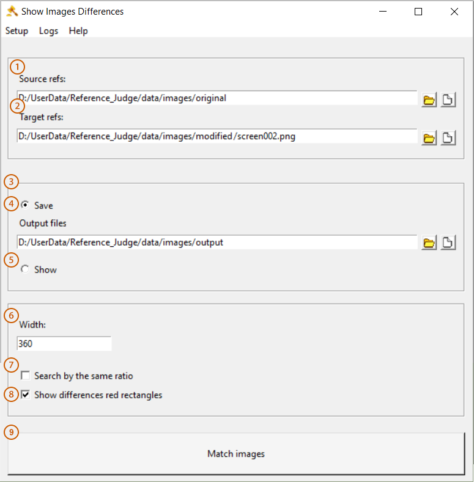
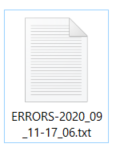
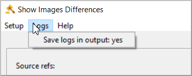
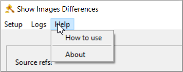

<h1 align="center"> Reference-Judge </h1>

 This program shows visual differences between chosen images.  
Similar images are matched automatically, to get the best result try to match images with the same sizes 

## Getting Started 💡

Find **Reference-Judge.exe** in the folder, or run through `python Reference_Judge` command line in the directory where the folder exists

To run only UI version you don't have to provide any arguments, just press "enter"

If you want to use the console: [**How to use console**](docs/How_to_use_console.md)

## Using UI version 👀

1. Firstly, you choose the **source** folder/file/url to **process**
2. Next, you choose the **target** folder/file/url to **compare** to
3. Later, you check **mode** in which you want to display images:

- **Save**
- **Show**

4. In **save mode** you choose the folder in which your matches will be saved  
   To do that you have to provide a **path** in the **output dialog** box

- When a name should be the **same as in source**, provide the output path as a **folder**
- When a name should be **specified**, provide the output path as a **file**

5. In **show mode** there will be automatically displayed matched images  
   To go to the next set of images press **"0"** key

6. The **width** dialog is responsible for the size in which images will be rendered  
   minimal value is **1**, maximal value is **1080**, it's set mainly for performance reasons

7. The checkbox **Search by the ratio** enables searching similar images with different sizes but only with the same ratio  
   sizes of **original** image compared to **target** image are from **0.5** to **4.0** times  
   any ratios of **target** images below or above these values are disregarded  
   Generally, it's not recommended to use this option due to image distortions

8. The final step is to push the button **"Match images"**  
   Depending on a number of images to process results should appear fairly fast  
   Images are automatically **matched** on the degree of **similarity**  
   The **naming** of files does **not matter** in that case

9. **Enjoy** the results!

## Errors ⚠️

1. If you use **"Save mode"**:  
   When **errors occur**, then it will be **created .txt** file where **errors** are **stored**  
   **.txt** file is **stored** in the selected folder **in output** folder  
   Each **.txt** file looks like: **ERROR-(date when the script ran).txt**:

2. If you use **"Show mode"**:  
   When **errors occur**, then pop-up window with listed **"not found"** files matches will appear

For both modes you will get pop-up notification about the quantity of **errors**

### Type of **errors**:

- When there is no match for **source** image among **target** images
- When **matched** images are not saved

## Setup 💾

The areas marked **in red** are **options** which can be **saved**, **loaded** as setup files  
Setups are stored in **"program/data/appData/"**

To process setups, in menu **"Setup"** are located following options:

1. **Save as**, save current setup into **.ini** file
2. **Open**, open setup **.ini** file
3. **Save to defaults**, save current setup as **defaults** (**load that** setup each time when **program starts**)
4. **Reset to defaults**, load **defaults**
5. **Defaults reset**, overwrite **defaults** to **standard** values and **load** them

## Logs 📜

In this place, you can choose if errors logs are appear or not  
In **Save mode** errors logs are saved in the matched files output directory  
In **Show mode** errors logs are in pop-up box

## Help ℹ️

It consists of:

- How to use program
- About (program and it's creator)

## Running the tests 🧪

To run tests, write down in the terminal, in the program folder:
`python tests.py`

## Built With 🧰

- [**Required packages and Python ver**](Pipfile)

## Needed documentation 📦

- [**OpenCV**](https://opencv.org)
- [**Scikit-image**](https://scikit-image.org/)
- [**NumPy**](https://numpy.org/)

## Structure of the code 🧭

[**Flow diagram**](docs/images/simpified_model_of_program.png)

## Contributing 📬

Please read [**CONTRIBUTING.md**](docs/CONTRIBUTING.md) for details on our code of conduct, and the process for submitting pull requests to us

## Versioning 🗓️

We use [**SemVer**](http://semver.org/) for versioning in [**CHANGELOG.md**](docs/CHANGELOG.md)

## Authors 🎈

- **Karol Łukaszczyk** - _Initial work_ - [**Lukkar**](https://github.com/Lukkar90)

## License 📜

This project is licensed under the MIT License - see the [**LICENSE**](docs/LICENSE) file for details

## Acknowledgments 👍

- _README-template.md, CONTRIBUTING-template.md_ by [**PurpleBooth**](https://gist.github.com/PurpleBooth)
- [**CreateToolTip**](https://www.daniweb.com/programming/software-development/code/484591/a-tooltip-class-for-tkinter) by [**vegaseat**](https://www.daniweb.com/members/19440/vegaseat)
- [**main idea inspired by**](https://www.pyimagesearch.com/2017/06/19/image-difference-with-opencv-and-python/) by [**Adrian Rosebrock**](https://www.pyimagesearch.com/contact/)
